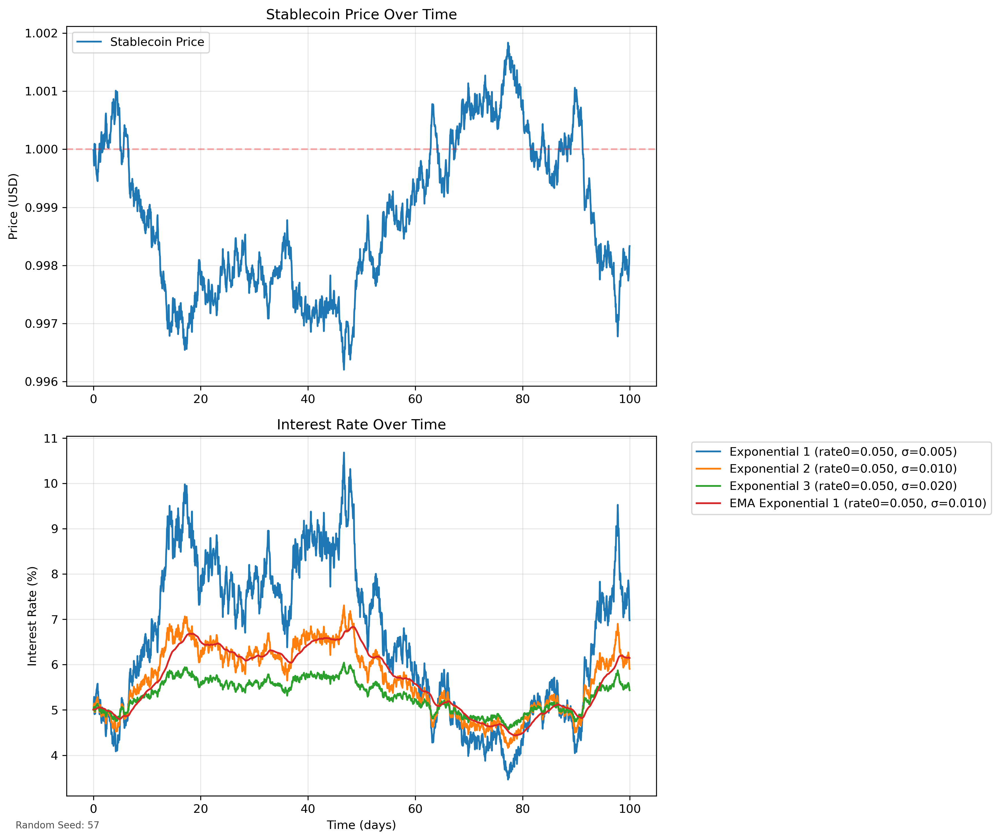

A Collateralized Debt Position (CDP) is a mechansm used in DeFi where users lock up collateral assets generate debt in the form of a stablecoin. The locked collateral ensures the borrowed amount remains secure, and if its value drops below a certain threshold, it may be liquidated to cover the debt.

# Overall Structure

## Protocol Config
- Stores global parameters: base interest rate, sigma (volatility factor), total protocol debt, stablecoin mint config, etc.
- Maintains the global interest rate update function (exponential model) and tracks cumulative interest for all positions.

## Collateral Vault Config
- Each supported collateral has its own vault config:
  - Total collateral deposits
  - Total debt for that collateral type
  - Reward/penalties for stakers
- Also includes a vault token account and a liquidation rewards vault, tied to an "auth" key.

## Positions
- Each user’s position includes:
  - `collateral_amount`
  - `debt_amount`
  - Reference to the user’s previous interest rate index
- On open/close/modify, the protocol calculates updated debt with accrued interest.

## Stability Pool
- Users can stake stablecoins into a "stake vault" for each collateral type.
- Liquidations take collateral from unhealthy positions and distribute it proportionally to stakers as liquidation rewards.

## Liquidation Mechanism
- Protocol forcibly repays an undercollateralized position’s debt using the stability pool’s stablecoins.
- Seized collateral is transferred into the pool’s reward vault.
- Stakers can claim collateral from that reward vault.

---

# Current Interest Rate Model
- An exponential function of price deviation:  
  `rate = base_rate * e^((peg - stable_price)/sigma)`
- If the stable trades below peg, the interest rate quickly rises.
- If stable is above peg, the rate stays near base or even goes lower (bounded by min interest).

To validate our interest rate model design, we conducted simulations using synthetic price data generated through Brownian motion. The simulation compared different interest rate models over a 100-day period to evaluate their responsiveness and stability. The exponential model with low sigma showed the most aggressive response to price deviations, while larger sigma values produced more moderate responses. 

The EMA-smoothed version demonstrated reduced rate volatility while maintaining responsiveness to price changes. After analyzing these results, we selected a base rate of 5% and σ=0.02 as our parameters, striking a balance between stability and sufficient responsiveness to price deviations. In future, we would like to analyze our interest rate formula and compare it to the historical rates of competitors. Additionally using a smoothed version of the interest rate will also be considered to provide a low volatile solution.

---

# Upfront Mint Fee / Peg Defense
- When users open a position, if the stable is below peg, the protocol charges an upfront cost (e.g., 7 days of interest).
- This fee is minted directly into the stability pool vault, raising the cost of new supply when the stable is cheap.

---

# Design Choices & Rationale

## Lower Rates vs. Lending Markets
- In bull markets, standard lending markets see high borrow APYs for USDC/USDT.
- A CDP-based stablecoin can have lower rates if demand for borrowing is less correlated to alt-coin mania.
- This is a marketing advantage.

## Mint Fee & Slower Growth
- The protocol wants steady growth rather than FOMO or panic.
- A small mint fee helps limit extreme expansions.
- Interest rate (including upfront cost) is higher if the stable trades below peg, discouraging oversupply.

## Managing Bull/Bear Cycles
- In a bull market, stablecoins are at or above peg, making interest rates more attractive (lower) than standard lending markets.
- In a bear market, supply contracts; focus is on stable risk management and good liquidations so users trust the system next cycle.

---

# Peg-Keeping Approaches

## Current Approach
- Managed via interest rate adjustments: If the stable price drifts below peg, the protocol’s interest rate automatically rises, discouraging more minting.
- Liquidations ensure collateral is sold if positions become unhealthy, reducing the circulating supply of the stablecoin.

## Potential Future Approaches
- **Liquity‐style redemptions:**
  - The team has reservations due to subpar user experience.
  - Implementing a direct copy of Liquity v2 might be advantageous as it intrigues potential users.
- **Curve‐like peg keeper:**
  - Protocol mints/sells stables when price is above 1.
  - Buys/burns when price is below 1.

---

